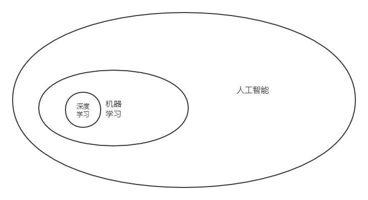

# 深度学习上手指南
作者：徐嘉诚（参考 + 自己理解）
## 说明
要（快速）上手一个一个方向或者一个小领域，一般来说需要掌握一些基础知识（最基本的概念和原理）、前沿进展（近几年的研究方向与热点）和特定的工具（例如编程语言、框架）。此外，如果有能力阅读一些有价值的论文、博客，那就更好了。
## 前提
- 良好的英语水平
- 一定的编程经验
- 基本的数学功底。例如，什么是矩阵运算，什么是联合分布，什么是导数。如果这些基本概念都没有，可能需要再补一补，但一般来说，很多课程是self-packed的。
## 基础知识
深度学习是机器学习的一个子方向，而机器学习又是人工智能的一个分支。

## 机器学习
机器学习入门首推Andrew Ng在Coursera的公开课[机器学习](https://www.coursera.org/learn/machine-learning)，深入浅出。上完了这门课之后，应该对于机器学习的基本概念比较清楚了。

如果你对于统计机器学习或者一些经典的方法感兴趣，推荐看李航老师的 **《统计学习方法》** ，竞品（同类中文教材）中无出其右。

如果你想再深入理解一下机器学习的来龙去脉（Ng在Coursera开的这门课是面向零基础同学开设的，难度有限），你可以参考一下斯坦福大学的机器学习课 [CS229@Stanford](http://cs229.stanford.edu/)，做好这门课的作业，把Lecture Note读个几遍，应该可以吊打至少90%的想申请机器学习或者数据科学的研究生的竞争者了。其实，市面上有太多的机器学习（和深度学习）的资源了（参考知乎问题：[深度学习如何入门？](https://www.zhihu.com/question/26006703)），与其兴致勃勃地把它们加入你的收藏夹，不如学好任何一门。

如果你学完了以上的这一两门课，就应该具备选择传统机器学习相关资料的能力了。值得一提的是，最好选一些有video、有assignment（和答案）的课程，这对于自学者尤为关键。

此外，不要吝惜代码，实现，虽然不是必要的，会很大程度上加深你的理解。
## 深度学习
深度学习的入门资源，按照从简单到困难的顺序我推荐以下几门课：

- [UFLDL Tutorial](http://ufldl.stanford.edu/tutorial/)是斯坦福大学Andrew Ng等人编纂的深度学习的入门教程，采用Matlab作为实现语言（这点似乎有些过时），而且官方自带中文版，是非常可贵的学习资料。
- [CS224d@Stanford](http://cs224d.stanford.edu/)是斯坦福大学博士毕业生、Salesforce首席科学家Richard Socher团队呈现的一门运用神经网络解决自然语言处理问题的课程，和CS231n应该是姐妹课程。本课程更注重RNN系列模型的运用。
- [CS231n@Stanford](http://cs231n.github.io/)是斯坦福大学李飞飞团队呈现的一门运用神经网络解决计算机视觉问题的课程，严格来说也不需要太多基础。本课程更注重CNN系列模型的运用。
- [N-N4ML](https://www.coursera.org/learn/neural-networks)是多伦多大学Geff Hinton教授录制的一门较为进阶的深度学习课程。如果没有一定的实战经验，可能会觉得这门课在讲天书，但有一定经验后回来看，里面藏了太多的黑科技。当然，Hinton爷爷的嗓音的确很催眠=。=

如果你顺利看完了上面的这些资源，应该已经算是20%的深度学习专家了；如果你做完了上面这些资源的Reading Material、Assignment和Lab，应该已经算是80%的深度学习专家了。到这里，你应该有能力看懂很多顶会的论文，当然这需要一定的时间。
## 前沿进展
### 文献
